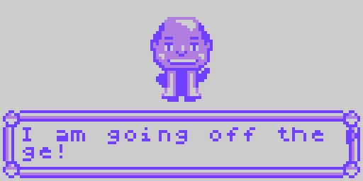
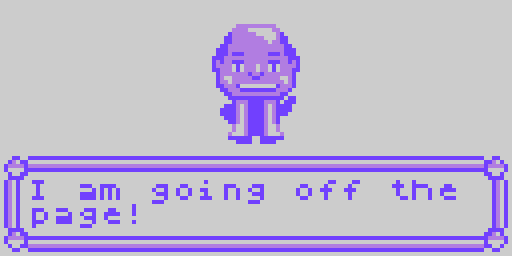
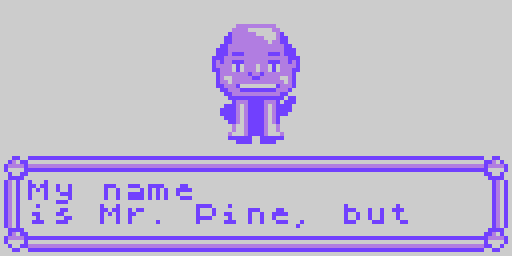

title: Welcome To Pikemanz

brief: Learn to draw your own Pikemanz and title screen and show them on the console.

authors: Brett Weir

In this segment, we can see how a dialog sequence like the kind found in many kinds of video games might work.

## Setup

Set up your code in the usual way.

    CON
        _clkmode        = xtal1 + pll16x
        _xinfreq        = 5_000_000

    OBJ
        lcd     :   "LameLCD"
        gfx     :   "LameGFX"
        map     :   "LameMap"
        ctrl    :   "LameControl"
        fn      :   "LameFunctions"

        state   :   "PikeState"
        menu    :   "PikeMenu"

Let's add some graphics. We're going to need two.

 - `gfx_mr_pine` is our friendly supporting character!

 - `gfx_arrow_d` is a tiny little arrow graphic that will come in handy later!

Add the objects to the code.

        nash    :   "gfx_mr_pine"
        arrow   :   "gfx_arrow_d"

Again, we will create a main function that calls another function that contains the actual demo.

    PUB Main
        lcd.Start(gfx.Start)
        ctrl.Start
        Scene

Use it to pass text to functions.

    PUB Scene
        state.SetState(state#_WORLD)

        ctrl.Update
        gfx.ClearScreen(gfx#WHITE)
        gfx.Sprite(nash.Addr,52,4, 0)

## Adding the dialog

### A basic dialog

Let's start with something simple. `PikeMenu` defines some functions for drawing some nice Pikemanz-style boxes; the kind that are perfect for displaying text.

    menu.Dialog(str)

In Spin, you can create a string on the fly with the `string` command.

    string("Some text goes here!")

Putting it together:

        menu.Dialog(string("TEACH: Hi there!"))

Then we're going to want to draw the screen, and wait for the player to click something before continuing (otherwise how will we read the text?).

        menu.Dialog(string("TEACH: Hi there!"))
        lcd.DrawScreen
        ctrl.WaitKey

Here's what you will see.

### Getting creative

The cool thing about this is... you can make him say whatever you want!

        menu.Dialog(string("I am an elephant!"))
        lcd.DrawScreen
        ctrl.WaitKey

### Uh oh, problem

If you tried to add a sentence longer than three or four words, you probably noticed that your text goes clear off the page and gets messed up.

        menu.Dialog(string("I am going off the page!"))
        lcd.DrawScreen
        ctrl.WaitKey

Well, that's annoying. How do we prevent that? Well, this is an important lesson. The LameStation is not your favorite word processor. Among other things that your desktop has that the LameStation does not, a text editor automatically *wraps* words at the end of a line, but we don't have that luxury, so we will have to *wrap* it manually.

We can do this by inserting a new line character into the string with the number 10.

10?! `'10'` is the ASCII character for a new line. It's the character that get spit out every time you press *Enter* on your keyboard. But you can't just press *Enter* in your code because strings can only fit on a single line, so you have to put them manually.

[Click here](http://en.wikipedia.org/wiki/ASCII) to learn more about ASCII, or [here](http://web.cs.mun.ca/~michael/c/ascii-table.html) to see a complete ASCII table.

        menu.Dialog(string("I am going off the",10,"page!"))
        lcd.DrawScreen
        ctrl.WaitKey

But I guess that should be changed to "I am NOT going off the page!"

### Spanning multiple pages

Okay, we've mastered adding a second line to the dialog box, but somehow the space for ten or so words *still isn't enough*! I guess we'll have to take some drastic measures. We'll have to continue the text *onto another page*.

Check this out; we're gonna add this line after we draw the dialog box.

    gfx.Sprite(arrow.Addr, 115,54, 0)

It's going to display the little arrow image we included in this project (`gfx_arrow_d`, remember?). We're going to draw it in a very specific spot, but you'll see the result.

Now we can continue the text on the next page and let the player know that they need to click the button!

        menu.Dialog(string("My name",10,"is Mr. Pine, but"))
        gfx.Sprite(arrow.Addr, 115,54, 0)
        lcd.DrawScreen
        ctrl.WaitKey

        menu.Dialog(string("you can call me",10,"TEACH."))
        lcd.DrawScreen
        ctrl.WaitKey

How cool is that!

## Shortening the code

I don't know about you, but I'm getting annoyed having to write `lcd.DrawScreen` and `ctrl.WaitKey` all the time. Surely, there must be a better way to do this? How can you shorten it?

### A convenience function

Well, this is what functions are for. Let's define some functions that contain all that special stuff.

We'll create two. The first we'll call `DisplayWaitDialog` because that's what it does; it displays the dialog, then waits for user input.

    PUB DisplayWaitDialog(str)
        menu.Dialog(str)
        lcd.DrawScreen
        ctrl.WaitKey

Now we can display a dialog window in one line!

        DisplayWaitDialog(string("In the Pikemanz",10,"world, you make..."))

One problem though. Now there's no way to display that little arrow like we had before. So let's add one more function. that displays that too.

    PUB DisplayWaitDialogArrow(str)
        menu.Dialog(str)
        gfx.Sprite(arrow.Addr, 115,54, 0)
        lcd.DrawScreen
        ctrl.WaitKey

### More than one way to...

We could have also added a parameter to the first function, which would have shortened the code even further. But then you have to remember that parameter every time you use the function, so it's a trade-off.

Here's what it would have looked like.

    PUB DisplayWaitDialog(str, arrow)
        menu.Dialog(str)

        if arrow
            gfx.Sprite(arrow.Addr, 115,54, 0)

        lcd.DrawScreen
        ctrl.WaitKey

It's a matter of preference really.

### Finishing up

Alright, now we're COOKING! Now we'll be able to add a ton of text with hardly any problem at all. So let's add some meaningful dialog.

        DisplayWaitDialog(string("TEACH: Hi there!"))

        DisplayWaitDialogArrow(string("My name",10,"is Mr. Pine, but"))
        DisplayWaitDialog(string("you can call me",10,"TEACH."))

        DisplayWaitDialogArrow(string("In the Pikemanz",10,"world, you make..."))
        DisplayWaitDialog(string("the rules."))

        DisplayWaitDialogArrow(string("You'll never play",10,"a game as good as"))
        DisplayWaitDialog(string("the one you make",10,"yourself!"))

Wow, that would have been so much longer if written the other way.

## The code

    CON
        _clkmode        = xtal1 + pll16x
        _xinfreq        = 5_000_000

    OBJ
        lcd     :   "LameLCD"
        gfx     :   "LameGFX"
        map     :   "LameMap"
        ctrl    :   "LameControl"
        fn      :   "LameFunctions"

        state   :   "PikeState"
        menu    :   "PikeMenu"

        nash    :   "gfx_mr_pine"
        arrow   :   "gfx_arrow_d"

    PUB Main
        lcd.Start(gfx.Start)
        ctrl.Start
        Scene

    PUB Scene
        state.SetState(state#_WORLD)

        ctrl.Update
        gfx.ClearScreen(gfx#WHITE)
        gfx.Sprite(nash.Addr,52,4, 0)

        DisplayWaitDialog(string("TEACH: Hi there!"))

        DisplayWaitDialogArrow(string("My name",10,"is Mr. Pine, but"))
        DisplayWaitDialog(string("you can call me",10,"TEACH."))

        DisplayWaitDialogArrow(string("In the Pikemanz",10,"world, you make..."))
        DisplayWaitDialog(string("the rules."))

        DisplayWaitDialogArrow(string("You'll never play",10,"a game as good as"))
        DisplayWaitDialog(string("the one you make",10,"yourself!"))

    PUB DisplayWaitDialog(str)
        menu.Dialog(str)
        lcd.DrawScreen
        ctrl.WaitKey

    PUB DisplayWaitDialogArrow(str)
        menu.Dialog(str)
        gfx.Sprite(arrow.Addr, 115,54, 0)
        lcd.DrawScreen
        ctrl.WaitKey

## Your turn

Here are some things you can do to test it out;

- Remove the existing conversation and add your own!

- Add your own graphics for Mr. Pine, or draw something else entirely, and create a dialog to describe it.

Have fun!

## CHALLENGE questions

* When the text *goes off the page* earlier in the tutorial, why does the text reappear on the other side of the screen instead of not being visible at all?
