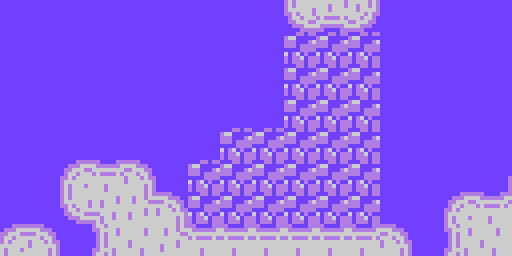

You probably noticed that we only got to see a small portion of the beautiful map that we have. Well, that really stinks, and is unacceptable. So in this demo, we're going to set things up so that you can move around on the screen.

The main things that will be different about this exercise than the last are that we're adding a loop and `LameControl` to the application so that we can get user input.

## Setup

The setup is the same as before.

    CON
        _clkmode = xtal1|pll16x
        _xinfreq = 5_000_000

    OBJ
        lcd     :   "LameLCD"
        gfx     :   "LameGFX"
        map     :   "LameMap"

        mp      :   "map_cave"
        tileset :   "gfx_cave"

But now we're going to add `LameControl`.

        ctrl    :   "LameControl"

Let's also create some variables, so we'll be able to keep track of where things are as we're moving around.

The first variables are the X and Y offset. In other words, this is how far away from the top-left corner of the map we want to display.

INSERT DIAGRAM

We'll appropriately call our new variables `xoffset` and `yoffset`

    VAR
        long    xoffset
        long    yoffset

We're going to add some other fanciness. We don't want to fall off the map, so we're going to add boundaries to the screen.

        long    bound_x
        long    bound_y

Time to start up the main function and set up the SDK, like in the previous demo.

    PUB Main

        lcd.Start(gfx.Start)
        map.Load(tileset.Addr, mp.Addr)

Here's where we actually set up and initialize the boundaries of the map.

        bound_x := map.GetWidth<<3 - lcd#SCREEN_W
        bound_y := map.GetHeight<<3 - lcd#SCREEN_H

There's some stuff happening here to be aware of.

 * `map.GetWidth`, `map.GetHeight` - these functions return the width and height of the currently loaded map in tiles. However, we don't want the number of tiles; we want the number of pixels, so we have to multiply by 8 since the tiles are 8x8 pixels in size.
 * `lcd#SCREEN_W`, `lcd#SCREEN_H` - `LameLCD` defines these constants which return the size of the screen, or 128 and 64. We're substract these from the size of the screen because the player's view of the screen actually takes up size, and this prevents the camera from straying off the screen.

 INSERT DIAGRAM EXPLAINING HOW THE MAP MOVES RELATIVE TO THE TOP-LEFT CORNER

For fun, let's put the starting position of the map at the same place of the previous demo, so you can see how it's changed.

        yoffset := bound_y

## Main Loop

Starting the main loop!

        repeat
            gfx.ClearScreen(0)

Add a control block to keep the view inside the map. What's cool is that we're not the ones doing the moving. The map itself moves relative to the screen, giving the illusion that we're moving in a world, but we're not!!

            ctrl.Update

            if ctrl.Up
                if yoffset > 0
                    yoffset--
            if ctrl.Down
                if yoffset < bound_y
                    yoffset++

            if ctrl.Left
                if xoffset > 0
                    xoffset--
            if ctrl.Right
                if xoffset < bound_x
                    xoffset++

Draw to the screen.

            map.Draw(xoffset, yoffset)
            lcd.DrawScreen

The finished product. You are looking at the same map as before, but now you will be able to move back and forth across it.

