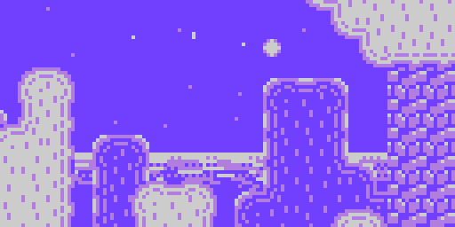

Nothing makes you feel like you're playing a real game like parallax scrolling; you know, like that feeling you get when you're on a long car ride and the mountains move so slowly but the street signs whoosh past you. It's that feeling that makes you feel like you're really going somewhere, and it's a cheap and easy way to add a touch of beauty and realism to your game.

Same setup as the previous two examples, but now we're going to add some extra graphics for the stuff that's going on in the background.

    CON
        _clkmode = xtal1|pll16x
        _xinfreq = 5_000_000
    OBJ

        lcd     :   "LameLCD"
        gfx     :   "LameGFX"
        map     :   "LameMap"
        ctrl    :   "LameControl"

Here's what it's going to have.

You've got your front level map.

        mp      :   "map_cave"

But now you've also got another map for the background tiles.

        mp2     :   "map_cave2"

Same tileset as before.

        tileset :   "gfx_cave"

But we're also going to add a beautiful backdrop to admire!

        bkdrop  :   "gfx_cavelake"

    VAR
        long    xoffset, yoffset
        long    offsetw, offseth
        long    w1, h1, w2, h2
        long    dx, dy

    PUB Main

        lcd.Start(gfx.Start)

        map.Load(tileset.Addr, mp.Addr)
        w1 := map.Width<<3-128
        h1 := map.Height<<3-64

        map.Load(tileset.Addr, mp2.Addr)
        w2 := map.Width<<3-128
        h2 := map.Height<<3-64

        dx  := w1/w2
        dy  := h1/h2

        yoffset := 64

        repeat
            ctrl.Update
            if ctrl.Left
                if xoffset > 0
                    xoffset--
            if ctrl.Right
                if xoffset < w1
                    xoffset++
            if ctrl.Up
                if yoffset > 0
                    yoffset--
            if ctrl.Down
                if yoffset < h1
                    yoffset++

            gfx.Blit(bkdrop.Addr)

            gfx.InvertColor(True)
            map.Load(tileset.Addr, mp2.Addr)
            map.Draw(xoffset/dx, yoffset/dy)
            gfx.InvertColor(False)

            map.Load(tileset.Addr, mp.Addr)
            map.Draw(xoffset, yoffset)

            lcd.DrawScreen

When you run your code, it will look completely flipping awesome. Why? Because now you don't just have the single tilemap, but two, and they're parallaxed against a backdrop, which creates a nice depth-of-field effect.

But don't take my word for it; see for yourself!

